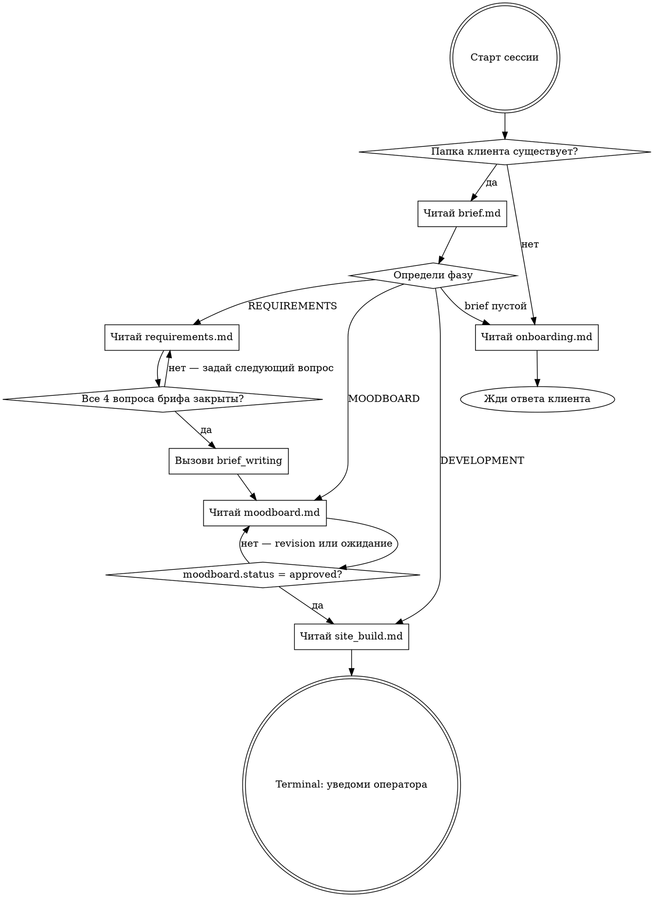

# Workflow: Digital Agency

<HARD-GATE>
Не переходи к фазе MOODBOARD пока brief.md не содержит ответы на все 4 вопроса.
Не переходи к фазе DEVELOPMENT пока moodboard.status != approved в brief.md.
Эти правила нельзя обойти даже если клиент торопится.
</HARD-GATE>

## Checklist — выполни в этом порядке

Создай TodoWrite задачу для каждого пункта:

1. **Определи состояние** — существует ли `clients/{chat_id}/`? Есть ли brief.md?
2. **Определи фазу** — прочитай brief.md, найди текущую фазу по критериям ниже
3. **Загрузи sub-prompt** — прочитай companion file для текущей фазы
4. **Выполни фазу** — действуй строго по sub-prompt
5. **Зафикси результат** — обнови brief.md после завершения фазы
6. **Подтверди переход** — проверь критерий завершения перед сменой фазы

---

## Process Flow

---

## Определение фазы

Читай `clients/{chat_id}/brief.md` и определи фазу по первому совпадению:

| Условие                                                              | Фаза         | Sub-prompt        |
| -------------------------------------------------------------------- | ------------ | ----------------- |
| Файл не существует или пустой                                        | ONBOARDING   | `onboarding.md`   |
| brief.md есть, но не заполнен                                        | ONBOARDING   | `onboarding.md`   |
| brief.md частично заполнен                                           | REQUIREMENTS | `requirements.md` |
| Все 4 вопроса закрыты, `moodboard` отсутствует или `status: pending` | MOODBOARD    | `moodboard.md`    |
| `moodboard.status: approved`, сайт не готов                          | DEVELOPMENT  | `site_build.md`   |

---

## Anti-Pattern: "Контекст из чата — этого достаточно"

Кажется что если в чате уже обсудили требования, бриф можно не писать.

**Это ловушка.** brief.md — единственный источник истины который переживает смену сессии.
Без записанного брифа следующая сессия начнётся с нуля. Всегда фиксируй в файле.

## Anti-Pattern: "Клиент торопится — пропустим мудборд"

Мудборд кажется опциональным когда клиент говорит "просто сделай сайт".

**Это ловушка.** Без согласованного визуального направления сайт придётся переделывать.
Hard gate выше — абсолютный. Исключений нет.

## Anti-Pattern: "Бриф почти готов — перехожу"

Три из четырёх вопросов закрыты — кажется можно двигаться.

**Это ловушка.** Незакрытый вопрос превращается в допущение, которое клиент опровергнет позже.
Если клиент не может ответить — предложи варианты. Только потом переходи.

---

## Мульти-сессионное резюме

При каждом новом сообщении от клиента:

1. Определи `chat_id` из контекста сообщения
2. Прочитай `clients/{chat_id}/brief.md` — это твоя память между сессиями
3. Определи фазу по таблице выше
4. Загрузи нужный sub-prompt и продолжай с того места где остановились

Не полагайся только на историю чата — brief.md авторитетен.

---

## Sub-prompts

Для каждой фазы перед началом работы прочитай соответствующий файл:

- **ONBOARDING** → прочитай `skills/workflow/onboarding.md`
- **REQUIREMENTS** → прочитай `skills/workflow/requirements.md`
- **MOODBOARD** → прочитай `skills/workflow/moodboard.md`
- **DEVELOPMENT** → прочитай `skills/workflow/site_build.md`

---

**Terminal state:** сайт задеплоен, клиент уведомлен, `phase_site_summary.yaml` заполнен → уведоми оператора с финальным URL и статусом проекта.
